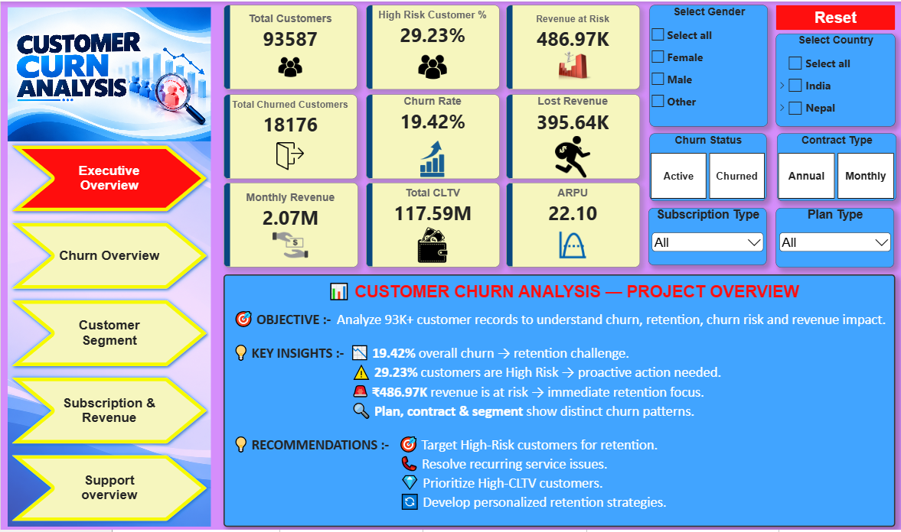
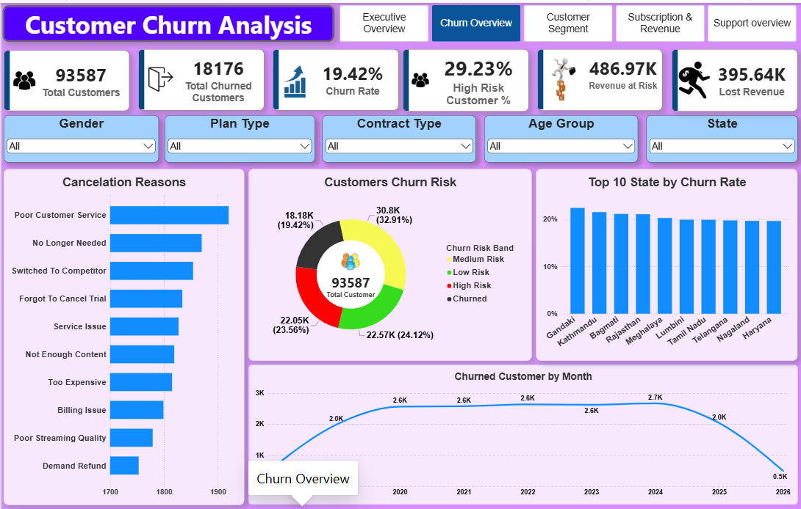
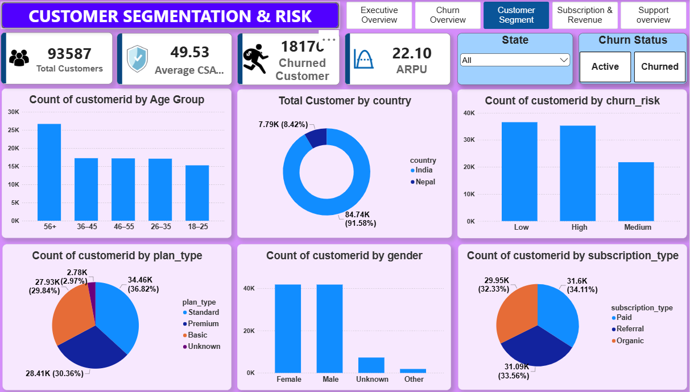
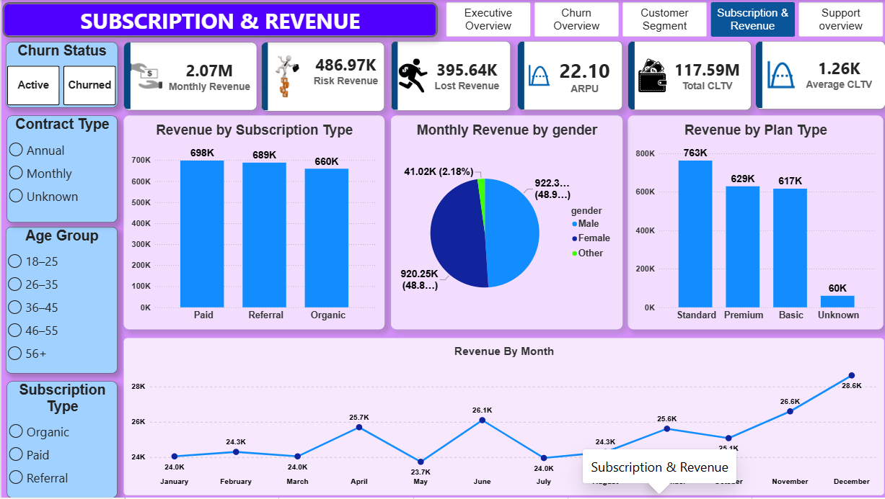
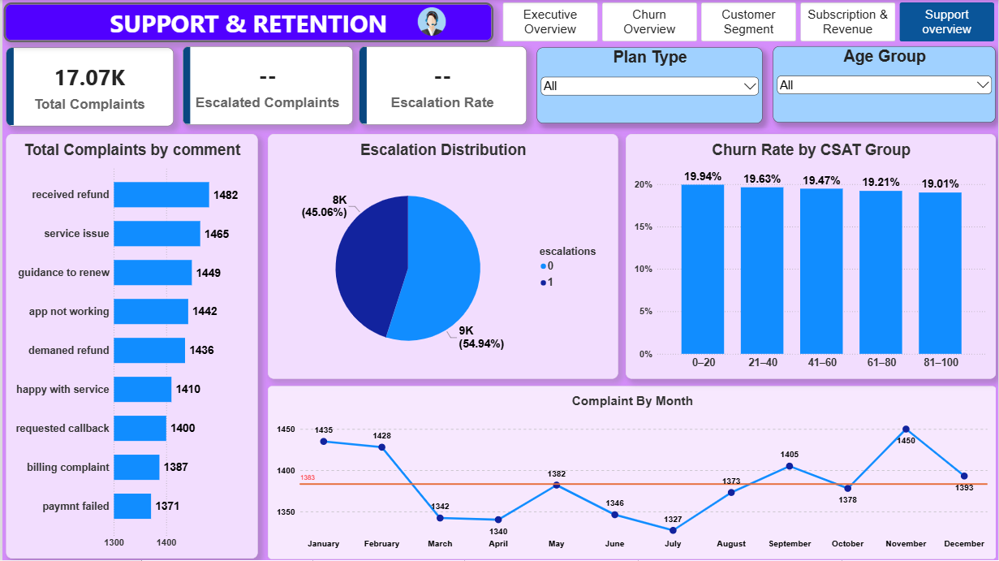

# 📊 Customer Churn Analysis

### End-to-End Data Analytics Project | Python • SQL • PostgreSQL • Power BI

<p align="center">
  
  
  
  
  
</p>

---

## 📌 Project Overview

Customer churn is one of the major challenges for subscription-based businesses because losing existing customers can directly impact **revenue, customer lifetime value, and long-term growth**.

This project performs an end-to-end analysis of customer churn using:

**Python → PostgreSQL → SQL → Power BI**

The goal is to understand **why customers leave, which customers are at higher risk, how churn impacts revenue, and where the business should focus its retention efforts.**

---

## 🎯 Business Objective

The main objective of this project is to identify customer churn patterns and provide **data-driven business recommendations** for improving customer retention.

### Key business questions:

- 🔹 What is the overall customer churn rate?
- 🔹 Which customer segments have higher churn?
- 🔹 Why are customers cancelling their subscriptions?
- 🔹 Does customer tenure affect churn?
- 🔹 Which subscription types have higher churn?
- 🔹 How much revenue is lost because of churn?
- 🔹 Which active customers are currently at high risk?
- 🔹 How does churn affect CLTV and monthly revenue?
- 🔹 Does customer support activity influence churn?
- 🔹 How can the business proactively reduce customer churn?

---

# 📈 Key Project Metrics

| KPI | Value |
|---|---:|
| 👥 Total Customers | **93,587** |
| 📉 Churn Rate | **19.42%** |
| 💚 Retention Rate | **80.58%** |
| ⚠️ Active High-Risk Customers | **~22K** |
| 🚨 High-Risk Active % | **29.23%** |
| 💰 Monthly Revenue | **₹2.07M** |
| 📉 Lost Monthly Revenue | **₹395.64K** |
| ⚠️ Revenue at Risk | **₹486.97K** |
| 💎 Total CLTV | **₹117.59M** |
| 💵 Average CLTV | **~₹1.26K** |

> 📌 These metrics are calculated from the final cleaned customer-level analytical dataset.

---

# 🖼️ Power BI Dashboard

### 📊 Executive Overview



### 📉 Churn Overview



### 👥 Customer Segment



### 💰 Subscription & Revenue



### 🎧 Support Overview



> 💡 **Tip:** Add your actual Power BI screenshots inside the `screenshots` folder using the same filenames.

---

# 🗂️ Dataset Structure

The analysis was performed using three major data sources.

### 👤 1. Customer Data

Contains customer-level information such as:

- Customer ID
- Name
- Gender
- Date of Birth
- Country
- State
- Customer attributes

### 💳 2. Subscription Data

Contains subscription and revenue information such as:

- Customer ID
- Plan Type
- Subscription Type
- Contract Type
- Monthly Charges
- CLTV
- Churn Flag
- Churn Score
- Cancellation Date
- Cancellation Reason
- Tenure

### 🎧 3. Support Data

Contains customer support information such as:

- Customer ID
- Support interactions
- Complaint information
- Escalations
- CSAT
- Support comments

---

# 🔄 Project Workflow

```text
        📂 Raw Data
             │
             ▼
      🧹 Data Cleaning
       Python / Pandas
             │
             ▼
      🗄️ PostgreSQL
             │
             ▼
       🔍 SQL Analysis
       80 Business Questions
             │
             ▼
     📊 Power BI Dashboard
             │
             ▼
    💡 Business Insights
             │
             ▼
   🎯 Recommendations


### 📌 For the images

For the dashboard screenshots, create a folder named:

```text
screenshots


